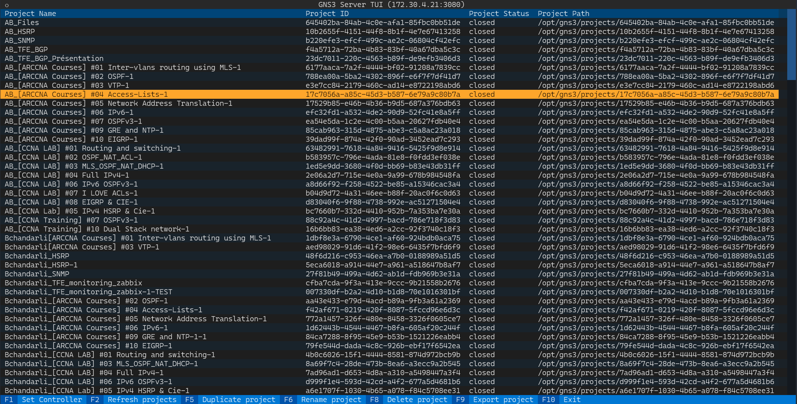

# pygns3tui
TUI application to manager GNS3 server using v2 API

## Screenshot


## Installation

### Clone the repository
```
git clone https://github.com/sdejongh/pygns3tui.git
```

### Install requirements
```
cd pygns3tui
pip install -r requirements.txt
```

### Install the package
Still in the project directory ...
```
pip install .
```

## Launch the app
From the terminal:
```
pygns3tui
```